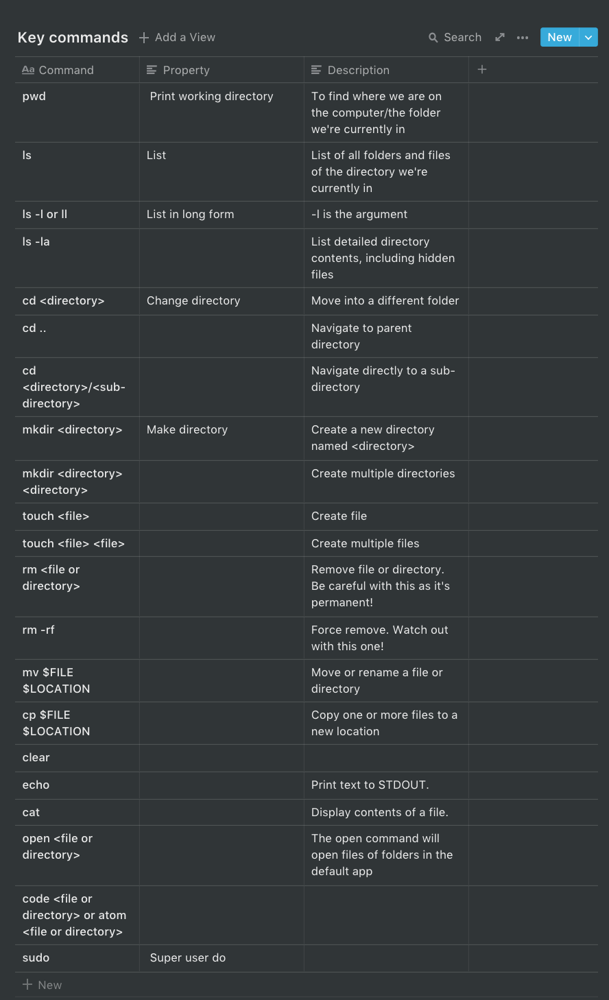
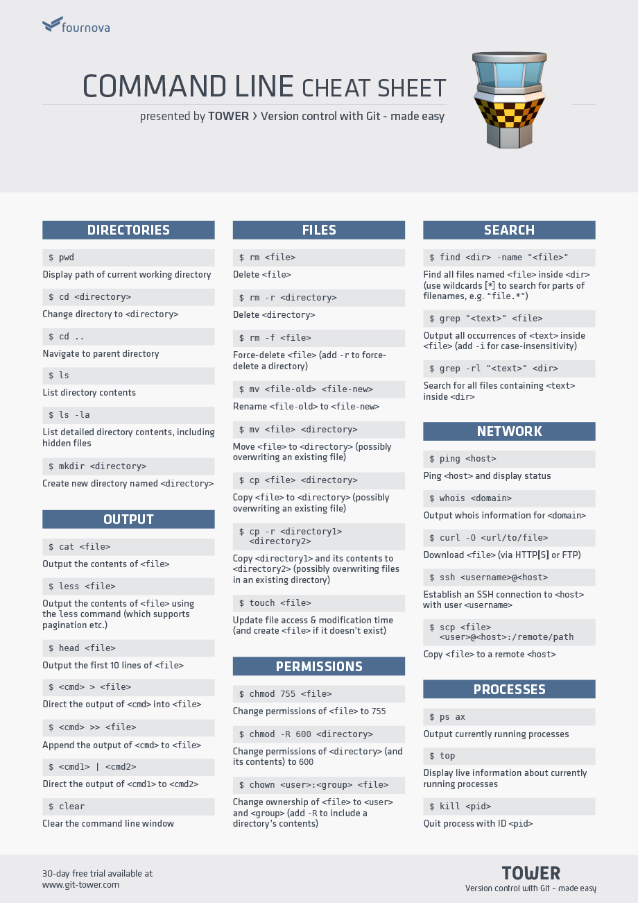

# Command Line: Getting Started

### **What is the command line?**

- **Command Line:** Allows for text-based communication with a computer / the line where you type your command.
- **Prompt:** This is the beginning of the command line. It usually provides some contextual information like who you are, where you are and other useful info. Typically ends in a **$**.
- **Terminal:** The interface / the program we use to talk to the computer.

Almost all commands have three parts: `program flags anyArguments`

- The `program` is a verb. It describes what you want to do e.g. print a list.
- A `flag` alters how the utility operates / is a preference / an adverb for the program. They usually start with `-`
- An `argument` is what the program takes in e.g. a file or directory name.

## Demo

1. Open terminal app (Linux shortcut: ctrl alt T)
2. Where are we in our computer? Type `pwd` and you'll see a path pointing you to where you are. Show this in the GUI. You now can access anything in this home directory.
3. `ls`: prints out a list of directories and files in the directory you're sitting in.
4. `cd <directory>` - tip: you can type a portion of the word and then press tab and it'll autocomplete. You can also type `cd` on its own to go back to your home directory.
5. `cd <directory>/<subdirectory>` :You can go into subdirectories at the
6. Let's make something. Usually you would right click in the GUI and make a new folder. `mkdir <directory` Note: you have to give mkdir an argument
7. Let's go into this directory and make a file: `touch <file>`
8. `touch <file> <file>`, `mkdir <directory> <directory>` : Make multiple files / directories
9. Shortcut:

        mkdir demo && cd demo

10. If you want to add code into this file from the terminal `vim <file>` and add code.

    OR open with atom or visual studio `atom index.html` or code `code index.html`

11. `cat`: Print this file (short for "concatenate").
12. Go up on the arrow key to cycle through previous commands
13. `cp <file> <newfile>`: copy file
14.  `mv <file> <newnamefile>`: rename
15. `mv <file> <directory>` : move into a different directory e.g. `mv orig_file.html subdir/` Note you have to create subdir first.
16. `mv <file> <path + newnamefile>`: move and rename e.g. `mv orig_file.html ../test_file.html`
17. Remove a file: `rm index.html`
18. Let's go back to the Desktop: `cd ..`
19. `rmdir <directory>` : removes an empty directory.
20. `man <program>` to print manual / help guides
21. `clear` to wipe the terminal

- `/` - The root directory or a separator when listing directories
- `.` - The current directory (also `./`) or the same level
- `..` - The directory one level up (also `../`)
- `../..` - Two levels up
- `~` - Your "home" directory, or the directory you are placed in when you log in.

## Exercises

1. Open Terminal app and print working directory
2. Navigate to your Documents folder and print its contents ie list of files and folders
3. Create a folder called command-line-demo and add these files: `index.html`, `style.css,` `script.js` and `README.md`.
4. Open `index.html` in vim, add in some HTML, and print its contents.
5. Copy `index.html` and name it `copy.html`.
6. Create a directory called newfolder inside command-line-demo and move copy.html into it.
7. Move style.css into newfolder and rename it styles.css in the same command.
8. Remove all files from the folder.
9. Delete command-line-demo folder.
10. Go back to home directory.

## Resources

[10 Basic Command Lines Every Designers Should Know](https://www.hongkiat.com/blog/web-designers-essential-command-lines/)

[Launch School - Introduction to the Command Line](https://launchschool.com/books/command_line/read/command_line_interface#whatiscliusedfor)

[Introduction to the Mac OS X Command Line - Treehouse Blog](https://blog.teamtreehouse.com/introduction-to-the-mac-os-x-command-line)

Cheat sheet source: https://www.git-tower.com/blog/command-line-cheat-sheet/

